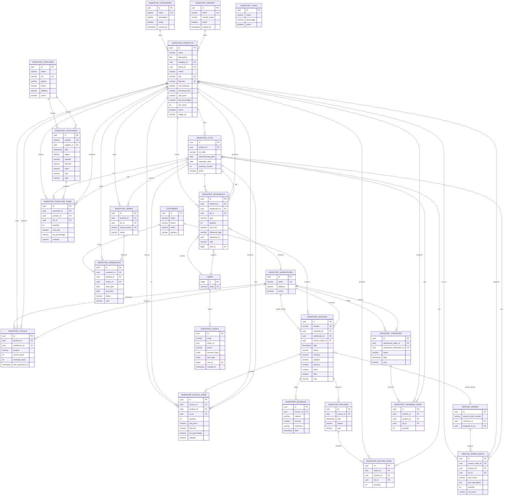

# Diagrama ERD - Sistema de Inventario y Facturación

## Diagrama Mermaid

## Descripción de Relaciones Clave

### Flujo de Venta
1. **Cliente** → **Factura** (`inventory_invoices`)
2. **Factura** → **Items** (`inventory_invoice_items`)
3. **Items** → **Productos** (`inventory_products`)
4. **Movimiento de Inventario** (tipo: `salida`) se genera automáticamente
5. **Stock** se actualiza (`current_stock` disminuye)

### Flujo de Compra
1. **Proveedor** → **Compra** (`inventory_purchases`)
2. **Compra** → **Items** (`inventory_purchase_items`)
3. **Lote** se crea si aplica (`inventory_lots`)
4. **Movimiento de Inventario** (tipo: `entrada`) se genera
5. **Stock** se actualiza (`current_stock` aumenta)

### Integración con Service Orders
- Las piezas agregadas por técnicos se almacenan en `service_order_parts`
- Al facturar, se crea `inventory_invoice` vinculada a `service_order_id`
- Los items de factura pueden referenciar productos del inventario

